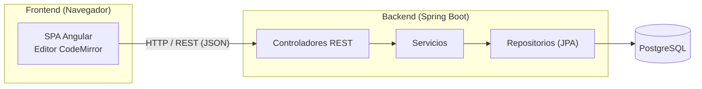
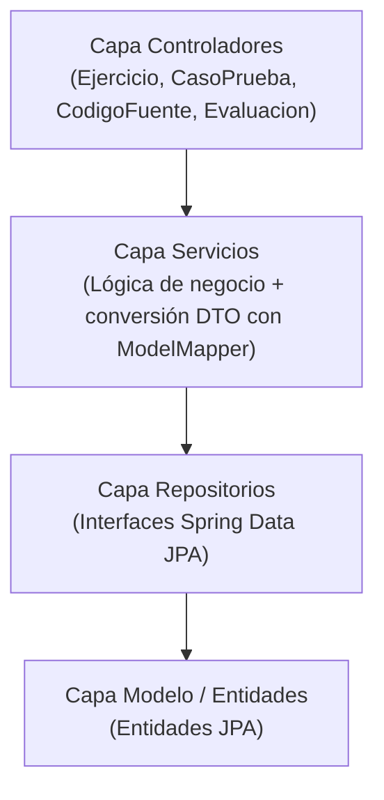
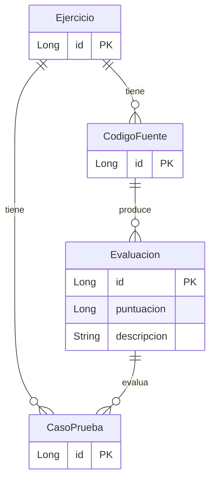

<!-- 🌐 [English](README.md) | [Español](README.es.md) -->

# Extra Editable

Aplicación web para edición y evaluación de código fuente, construida en torno a un editor de código online con soporte multi-lenguaje y evaluación automática de casos de prueba.

## Tecnologías

| Capa             | Tecnología                                                                                  |
|------------------|---------------------------------------------------------------------------------------------|
| Frontend         | Angular 21 (componentes standalone, signals), TypeScript 5.9                               |
| Editor           | CodeMirror vía `@acrodata/code-editor` (temas: Dracula, Nord, Solarized, Kimbie, One Dark) |
| Tooling frontend | Angular CLI 21, Vitest 4, npm 11, Node.js 22                                                |
| Backend          | Spring Boot 4.0.2, Java 25, Maven                                                           |
| Persistencia     | Spring Data JPA, Jakarta Persistence 3.1, ModelMapper 3.2, Lombok                           |
| Base de datos    | PostgreSQL                                                                                  |
| Testing          | Vitest (frontend), spring-boot-starter-webmvc-test (backend)                                |

## Arquitectura

El sistema sigue un modelo cliente-servidor: una SPA en Angular se comunica vía REST con un backend Spring Boot por capas.

### Capas del backend

### Modelo de dominio

