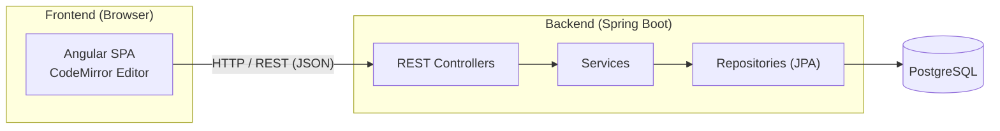
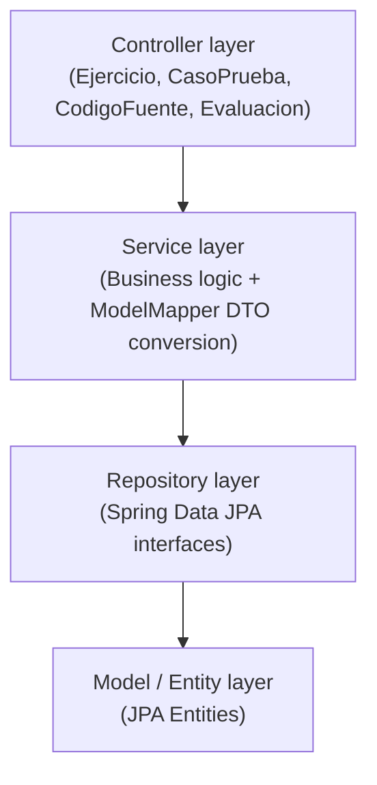
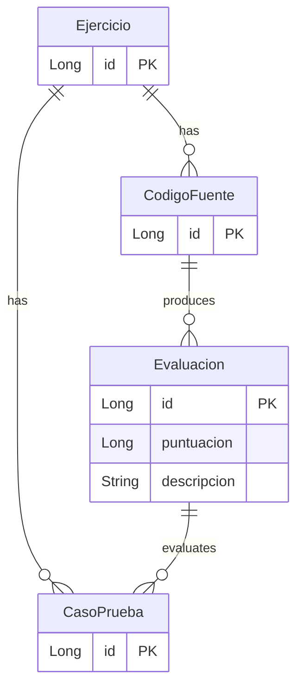

<!-- 🌐 [English](README.md) | [Español](README.es.md) -->

# Extra Editable

Web application for editing and evaluating source code, built around an online code editor with multi-language support and automated test-case evaluation.

## Technologies

| Layer            | Technology                                                                                  |
|------------------|---------------------------------------------------------------------------------------------|
| Frontend         | Angular 21 (standalone components, signals), TypeScript 5.9                                |
| Editor           | CodeMirror via `@acrodata/code-editor` (themes: Dracula, Nord, Solarized, Kimbie, One Dark) |
| Frontend tooling | Angular CLI 21, Vitest 4, npm 11, Node.js 22                                                |
| Backend          | Spring Boot 4.0.2, Java 25, Maven                                                           |
| Persistence      | Spring Data JPA, Jakarta Persistence 3.1, ModelMapper 3.2, Lombok                           |
| Database         | PostgreSQL                                                                                  |
| Testing          | Vitest (frontend), spring-boot-starter-webmvc-test (backend)                                |

## Architecture

The system follows a client-server model: an Angular SPA communicates over REST with a layered Spring Boot backend.

### Backend layers

### Domain model

